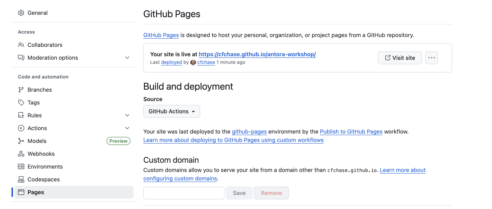

# Antora Workshop Template

### Running the workshop locally

```
cd workshop
npm install
npm run dev
```

### GitHub Pages




### References

https://docs.antora.org/antora/latest/install-and-run-quickstart/

https://github.com/redhat-developer-demos

https://github.com/rhpds/showroom_template_default